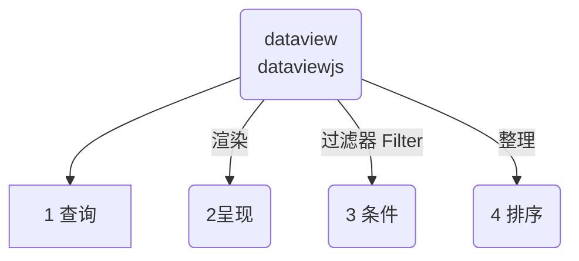

---
tags:
  - obsidian
---

dataview基本查询逻辑流程图

```mermaid
  flowchart TB
      A("dataview<br>dataviewjs") --> B["1 查询"]
      A -->|"渲染"| C("2呈现")
      A -->|"过滤器 Filter"| D("3 条件")
      A -->|"整理"| E("4 排序")
```

Specification