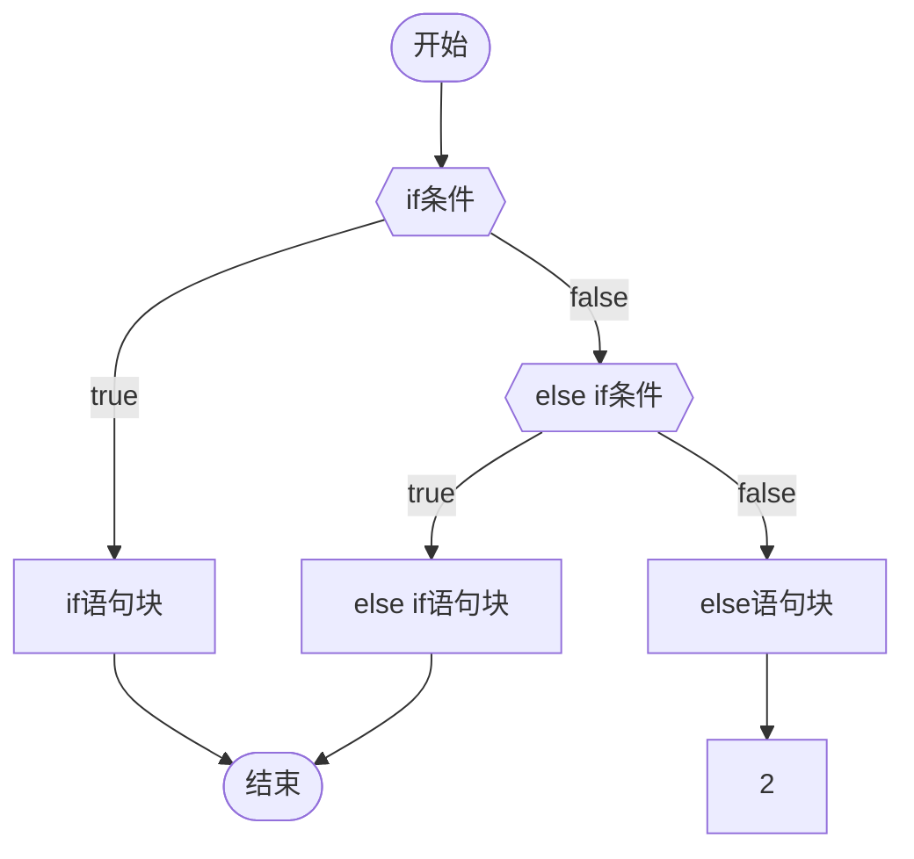
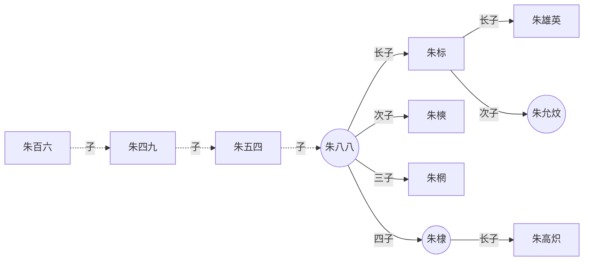
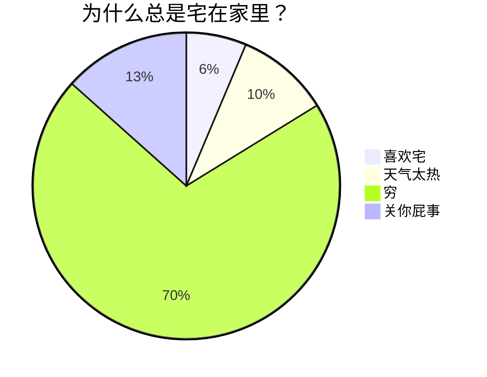

# Mermaid语法

```mermaid
graph TB
	%% s=start  e=end  f=fork  n=normal
	
	s([开始])-->f1{{if条件}};
	
	%% 分支点2
	f1--true-->n1[if语句块]-->e([结束]);
	f1--false-->f2{{else if条件}};
	
	%% 分支点1
	f2--true-->n2[else if语句块]-->e;
	f2--false-->n3[else语句块]-->2;
```

```mermaid
graph LR
	%% s=start  e=end  f=fork  n=normal
	
	%% 虚线
	s[朱百六]-.->|子|n1[朱四九]-.->|子|n2[朱五四]-.->|子|f1_帝((朱八八))
	
	%% 分支点 朱八八
	f1_帝-->|长子|f2[朱标]
	f1_帝-->|次子|n3[朱樉]
	f1_帝-->|三子|n4[朱棢]
    f1_帝-->|四子|n5_帝((朱棣))
    
    %% 分支点 朱标
    f2-->|长子|e1[朱雄英]
    f2-->|次子|e2_帝((朱允炆))
    
    n5_帝-->|长子|e3[朱高炽]
```

```mermaid
pie
	title 为什么总是宅在家里？
	"喜欢宅" : 45
	"天气太热" :70
	"穷" : 500
	"关你屁事" : 95
```

